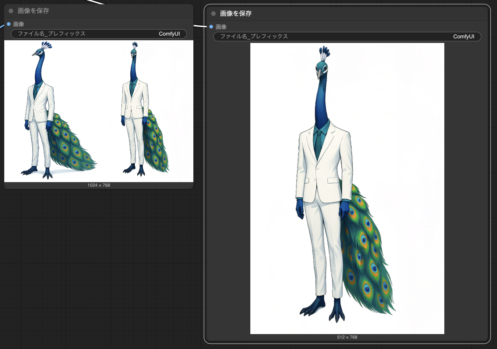

# ComfyUI-FramePackWrapper_PlusOne

**[日本語](./README.ja.md)**

[ComfyUI-FramePackWrapper_PlusOne](https://github.com/tori29umai0123/ComfyUI-FramePackWrapper_PlusOne) is a fork derived from [ComfyUI-FramePackWrapper](https://github.com/kijai/ComfyUI-FramePackWrapper) and [ComfyUI-FramePackWrapper_Plus](https://github.com/ShmuelRonen/ComfyUI-FramePackWrapper_Plus), containing FramePack's single-frame inference node (with kisekaeichi support).

This repository was forked for public release at the request of @tori29umai0123 [as requested here](https://x.com/tori29umai/status/1928692381735432320).

## Features

- **1-Frame Inference**: Supports basic single frame inference and the kisekaeichi method. For technical details, please refer to the [musubi-tuner documentation](https://github.com/kohya-ss/musubi-tuner/blob/main/docs/framepack_1f.md).
- **F1 Sampler Support**: Uses the improved F1 video generation method for higher quality and better temporal coherence
- **LoRA Integration**: Full support for HunyuanVideo LoRAs with proper weight handling and fusion options
- **Timestamped Prompts**: Create dynamic videos with changing prompts at specific timestamps
- **Flexible Input Options**: Works with both reference images and empty latents for complete creative control
- **Resolution Control**: Automatic bucket finding for optimal video dimensions
- **Blend Control**: Smooth transitions between different prompts at timestamps

### Not yet supported

- 1-Frame Inference: f-mc (one frame multi-control) is not supported yet.

## Installation

1. Clone this repository into your ComfyUI custom_nodes folder:
```bash
cd ComfyUI/custom_nodes
git clone https://github.com/xhiroga/ComfyUI-FramePackWrapper_PlusOne.git
```

2. Install the required dependencies:
```bash
pip install -r requirements.txt
```

3. Download the necessary model files and place them in your models folder:
- FramePackI2V_HY: [HuggingFace Link](https://huggingface.co/lllyasviel/FramePackI2V_HY)
- FramePack_F1_I2V_HY: [HuggingFace Link](https://huggingface.co/lllyasviel/FramePack_F1_I2V_HY_20250503)

## Model Files

### Main Model Options
- [FramePackI2V_HY_fp8_e4m3fn.safetensors](https://huggingface.co/Kijai/HunyuanVideo_comfy/blob/main/FramePackI2V_HY_fp8_e4m3fn.safetensors) - Optimized fp8 version (smaller file size)
- [FramePackI2V_HY_bf16.safetensors](https://huggingface.co/Kijai/HunyuanVideo_comfy/blob/main/FramePackI2V_HY_bf16.safetensors) - BF16 version (better quality)

### Required Components
- **CLIP Vision**: [sigclip_vision_384](https://huggingface.co/Comfy-Org/sigclip_vision_384/tree/main)
- **Text Encoder and VAE**: [HunyuanVideo_repackaged](https://huggingface.co/Comfy-Org/HunyuanVideo_repackaged/tree/main/split_files)

## Usage

See [example_workflows](./example_workflows).

| [1-Frame](./example_workflows/Oneframe.json) / [LoRA @tori29umai](https://huggingface.co/tori29umai/FramePack_LoRA/blob/main/Apose_V7_dim4.safetensors) | [1-Frame](./example_workflows/Oneframe.json) / [LoRA @kohya-ss](https://huggingface.co/kohya-ss/misc-models/blob/main/fp-1f-chibi-1024.safetensors) | [Kisekaeichi](./example_workflows/Oneframe_kisekaeichi.json) / [LoRA @tori29umai](https://huggingface.co/tori29umai/FramePack_LoRA/blob/main/body2img_V7_kisekaeichi_dim4_1e-3_512_768-000140.safetensors) |
| --- | --- | --- |
|  |  |  |

## License

[MIT License](LICENSE)

## Changelog

### v2.0.1 - Bug Fixes (2025-08-26)

#### New Features
- **Kisekaeichi Multi-Reference Support**: Kisekaeichi mode now supports multiple reference images as input, allowing for more complex and varied character style transfers.

#### Bug Fixes
- **Fixed generation failure on second and subsequent runs**: Resolved a dtype mismatch error (BFloat16 vs Float32) that caused failures when running generation multiple times in succession.

### v2.0.0 - Full musubi-tuner Compatibility (2025-08-08)

Achieved **complete compatibility with musubi-tuner specifications** to improve inference result consistency when using multiple reference images.

#### Breaking Changes

1. **The `denoise_strength` of workflows created up to v0.0.2 may be reset to 0.** After updating the node, please manually reset it to 1.0.

2. **Existing kisekaeichi workflows cannot be reused with this update.** The reference image input has been changed to a list format to support multiple reference images. Please refer to `Oneframe_kisekae_V2.json` in the example_workflows folder for the updated workflow structure.

#### Major Changes

**1. Improved Embedding Integration Method**
- ❌ Previous: Weighted average integration (70% input image, 30% reference images)
- ✅ **New:** musubi-tuner compatible processing (using first reference image embedding)

**2. Unified Latent Combination Structure**
- ❌ Previous: Separate management of input and reference images before combination
- ✅ **New:** Direct control_latents combination following musubi-tuner specification
  ```python
  control_latents = [input_image, reference_image1, reference_image2, ..., zero_latent]
  clean_latents = torch.cat(control_latents, dim=2)
  ```

**3. Optimized Mask Application Timing**
- ❌ Previous: Individual application before latent combination
- ✅ **New:** Mask application after clean_latents generation (musubi-tuner specification)

**4. Dynamic Index Setting Processing**
- ❌ Previous: Fixed clean_latent_indices configuration
- ✅ **New:** Dynamic application of control_indices parameters
  ```python
  # control_index="0;7;8;9;10" → clean_latent_indices = [0, 7, 8, 9, 10]
  while i < len(control_indices_list) and i < clean_latent_indices.shape[1]:
      clean_latent_indices[:, i] = control_indices_list[i]
  ```

**5. Improved latent_indices Initialization**
- ❌ Previous: ComfyUI-specific initialization method
- ✅ **New:** musubi-tuner specification initialization
  ```python
  latent_indices = torch.zeros((1, 1), dtype=torch.int64)
  latent_indices[:, 0] = latent_window_size  # default value
  latent_indices[:, 0] = target_index        # parameter application
  ```

#### Expected Benefits

- **Improved Inference Consistency**: Generate identical results to musubi-tuner with same reference images and parameters
- **Stabilized Multi-Reference Processing**: More stable quality through accurate index management
- **Parameter Compatibility**: Correct functionality of musubi-tuner's control_index and target_index parameters

#### Technical Details

This update ensures the following processing flow matches musubi-tuner completely:

1. **Control Image Processing**: Sequential processing of multiple images specified by `--control_image_path`
2. **Index Management**: Dynamic application of `--one_frame_inference="control_index=0;7;8;9;10,target_index=5"`
3. **Embedding Processing**: Implementation simulating section-wise individual processing
4. **Mask Application**: Unified mask processing after clean_latents construction

## Credits

- [FramePack](https://github.com/lllyasviel/FramePack): @lllyasviel's original implementation.
- [ComfyUI-FramePackWrapper](https://github.com/kijai/ComfyUI-FramePackWrapper): @kijai's original implementation.
- [ComfyUI-FramePackWrapper_Plus](https://github.com/ShmuelRonen/ComfyUI-FramePackWrapper_Plus): @ShmuelRonen's F1-supported fork.
- [ComfyUI-FramePackWrapper_PlusOne](https://github.com/tori29umai0123/ComfyUI-FramePackWrapper_PlusOne): @tori29umai0123's 1-frame inference-supported fork.
- [musubi-tuner](https://github.com/kohya-ss/musubi-tuner): @kohya-ss's high-quality FramePack training and inference library
